# Part I: Introduction to Robotic Systems
## What Is a Robot?

A robot is a programmable physical system that senses its environment, makes decisions, and acts on the world to accomplish a task. At its core, every robot repeats the same loop:

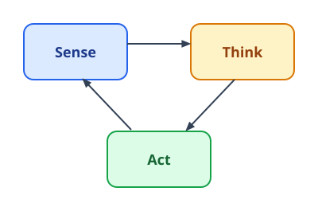

## Sensors and Actuators

* **Sensors** (cameras, LiDAR, wheel encoders, IMUs, force/touch sensors) perceive the environment and the robot's own state.
* **Actuators** (motors, servos, hydraulic and pneumatic drives) act on the world, turning commands into motion.

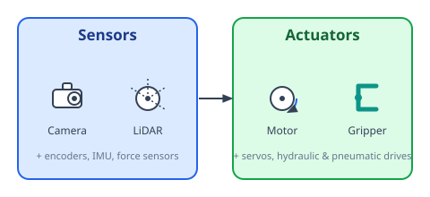

The chapters ahead are about closing the loop between the two: turning sensor measurements into the right actuator commands.

## Open-Loop vs. Closed-Loop Control

* **Open-loop control** sends commands to the actuators without checking the result — like a washing machine running on a fixed timer. It's simple, but any disturbance or model error goes uncorrected.
* **Closed-loop control** uses sensor feedback to compare the actual state against the goal and continuously corrects the error. This is how most real-world robots operate.

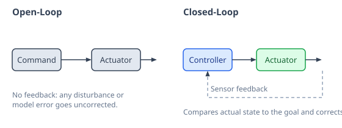

Chapter 3 builds on this idea directly: its controllers compute exactly how much correction to apply at each step, based on the error between the current and goal pose.

## Model-Based vs. Model-Free Control

* **Model-based control** uses an explicit mathematical model of the robot — its frames, transforms, and Jacobians — to compute the correction needed at each step. This is the approach this book builds, step by step.
* **Model-free control** skips the explicit model and learns a control policy directly from data and experience, at the cost of needing far more of it.

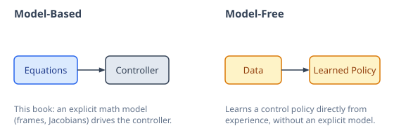

## Kinematics vs. Dynamics

* **Kinematics** describes motion in terms of positions, velocities, and accelerations, without asking what caused it. This is pure geometry, and it's the focus of this book.
* **Dynamics** goes further, relating motion to the forces and torques that produce it, along with mass and inertia.

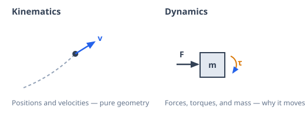

## Mobile Robots vs. Manipulators

* **Mobile robots** (wheeled, legged, aerial) move their entire body through the environment. Their kinematics describes how wheel or leg motion translates into changes in position and heading.
* **Manipulators** (robot arms) stay fixed at their base and move an end-effector through a chain of joints. Their kinematics describes how joint angles translate into the position and orientation of that end-effector.

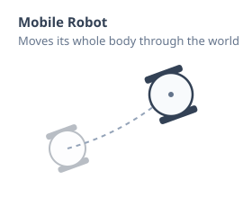

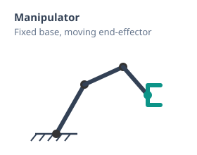

Both are described with the same underlying math — frames, rotations, and transformations.

## Revolute vs. Prismatic Joints

* **Revolute joints** rotate about a fixed point, like an elbow or a door hinge. Their variable is an angle, $\theta$ or $q$.
* **Prismatic joints** slide along a fixed axis, like a piston or a linear rail. Their variable is a distance, $d$ or $q$.

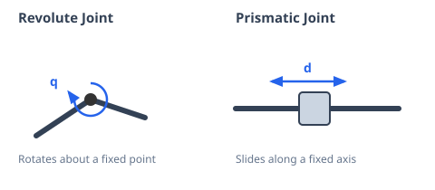

Every manipulator is a chain of these two joint types — most are built entirely from revolute joints, since they're cheaper and more common in practice.

## Degrees of Freedom (DOF)

A robot's **degrees of freedom** are the independent ways it can move. DOF is counted in two different spaces:

* **Actuator-space DOF** — the number of independently driven joints or motors.
* **Cartesian-space DOF** — the number of independent directions the end-effector (or body) can move in the world: up to 3 in 2D (position and heading), or up to 6 in 3D (three for position, three for orientation).

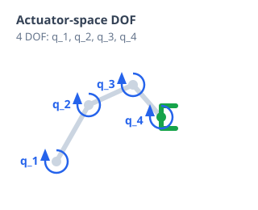

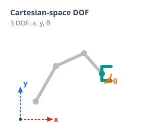

These two counts don't have to match. A robot is **redundant** when it has more actuator-space DOF than Cartesian-space DOF, and **underactuated** when it has fewer.

## Open-Chain vs. Closed-Chain Mechanisms

* **Open-chain (serial) mechanisms** connect their links in a single unbranched sequence, from the base to the end-effector, with no loops.
* **Closed-chain (parallel) mechanisms** connect their links into one or more closed loops, like a four-bar linkage or a Stewart platform.

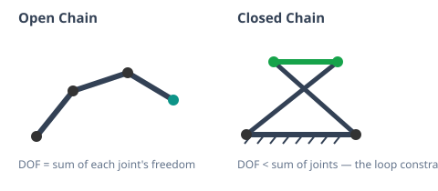

In an open chain, DOF is simply the sum of each joint's freedom. In a closed chain, the loop constrains the joints, so DOF ends up *lower* than the raw joint count — how the joints are connected can give or take away freedom, not just how many motors drive them.

## Holonomic vs. Non-Holonomic Constraints

* **Holonomic robots** can move directly in any direction their DOF allow — turning and sliding sideways at the same time, like an omnidirectional robot.
* **Non-holonomic robots** can't do that — a car or a differential-drive robot has to turn before it can move sideways, even though it can still reach any position eventually (think parallel parking).

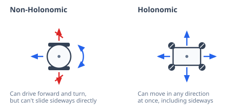

Whether a mobile robot is holonomic or not comes down to its wheels. Differential-drive and car-like robots are non-holonomic; omnidirectional wheels remove that restriction entirely. Depending on where and how a wheel is mounted, it can add a DOF, remove one, or have no effect at all.

## Compliance vs. Rigidity

* **Rigid robots** resist external forces and hold their commanded position as precisely as their actuators allow. Most industrial arms are built this way.
* **Compliant robots** yield to external forces instead of fighting them, either through soft, springy hardware or through control software that makes a rigid robot behave that way.

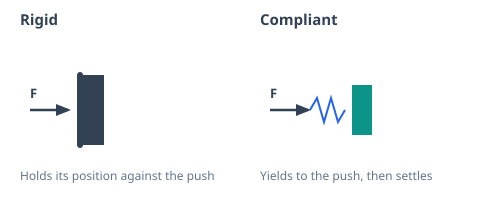

Compliance doesn't require special hardware — a common technique called **impedance control** lets an otherwise rigid robot behave like a spring, purely in software. This trade-off matters most where robots interact with people or uncertain environments, like collaborative robots (cobots).