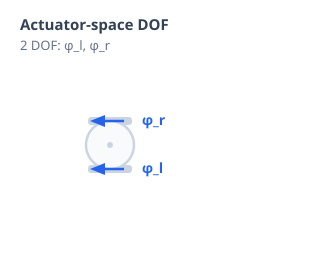
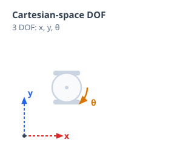

# Part I: Introduction to Robotic Systems
## What Is a Robot?

A robot is a programmable physical system that senses its environment, makes decisions, and acts on the world to accomplish a task. At its core, every robot repeats the same loop:

**sense → think → act**

## Sensors and Actuators

* **Sensors** (cameras, LiDAR, wheel encoders, IMUs, force/touch sensors) perceive the environment and the robot's own state.
* **Actuators** (motors, servos, hydraulic and pneumatic drives) act on the world, turning commands into motion.

The chapters ahead are about closing the loop between the two: turning sensor measurements into the right actuator commands.

## Mobile Robots vs. Manipulators

* **Mobile robots** (wheeled, legged, aerial) move their entire body through the environment. Their kinematics describes how wheel or leg motion translates into changes in position and heading.
* **Manipulators** (robot arms) stay fixed at their base and move an end-effector through a chain of joints. Their kinematics describes how joint angles translate into the position and orientation of that end-effector.

Both are described with the same underlying math — frames, rotations, and transformations.

## Degrees of Freedom (DOF)

A robot's **degrees of freedom** are the independent ways it can move. DOF is counted in two different spaces:

* **Actuator-space DOF** — the number of independently driven joints or motors.
* **Cartesian-space DOF** — the number of independent directions the end-effector (or body) can move in the world, up to 6: three for position, three for orientation.

These two counts don't have to match. A robot is **redundant** when it has more actuator-space DOF than Cartesian-space DOF, and **underactuated** when it has fewer.

