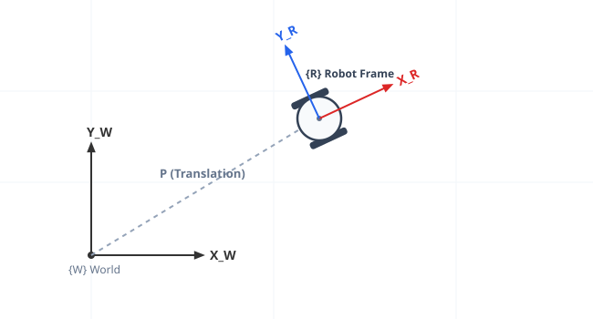
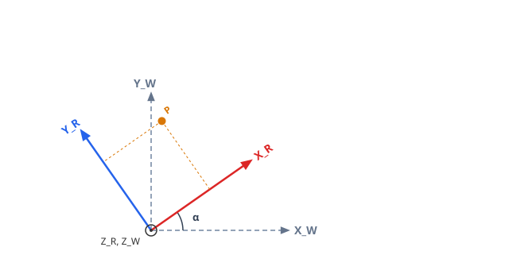
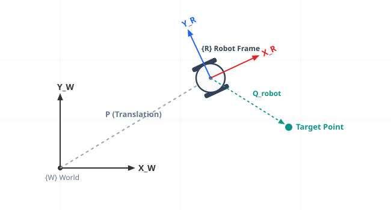
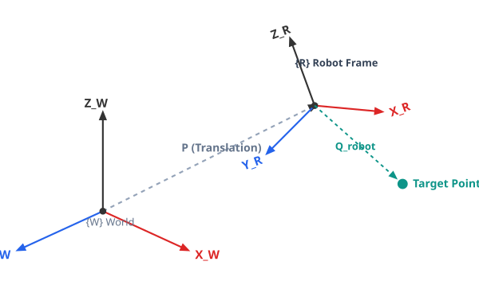
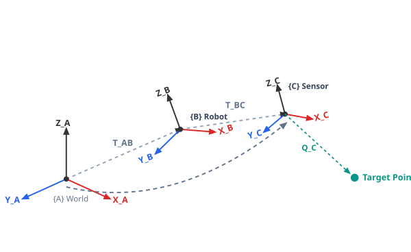
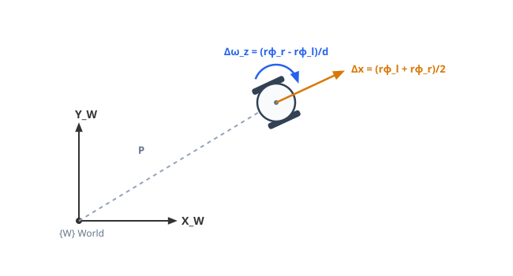
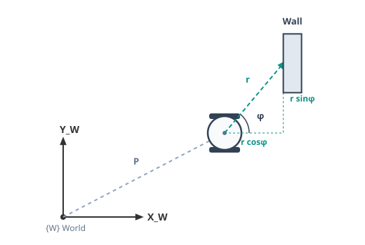

# Part II: Spatial Representation

## Cartesian Space

To describe a robot's position in space, we must account for both its **position** (translation) and its **orientation** (rotation). This position and rotation are always defined relative to a world coordinate frame. This representation is known as **Cartesian space**.

<p markdown="1" style="text-align:center;">

</p>

## Describing Position and Rotation

A robot's location can be described with three values, one along each of the $X$, $Y$, and $Z$ axes, measured relative to the world frame:

$$
\vec p = \begin{bmatrix}c_1\\c_2\\c_3\end{bmatrix}
$$

A robot also has an orientation — its roll, pitch, and yaw. We can expand the previous formula in the following manner:

$$
\vec p = \begin{bmatrix}c_1\\c_2\\c_3\end{bmatrix} = c_1\begin{bmatrix}1\\0\\0\end{bmatrix} + c_2\begin{bmatrix}0\\1\\0\end{bmatrix} + c_3\begin{bmatrix}0\\0\\1\end{bmatrix} = c_1\vec b_1 + c_2\vec b_2 + c_3\vec b_3
$$

$$
\vec p = \begin{bmatrix}\vec b_1 & \vec b_2 & \vec b_3\end{bmatrix}\begin{bmatrix}c_1\\c_2\\c_3\end{bmatrix}
$$

$$
\vec p = \begin{bmatrix}1&0&0\\0&1&0\\0&0&1\end{bmatrix}\begin{bmatrix}c_1\\c_2\\c_3\end{bmatrix} = R\vec c
$$

Here, $R$ represents the robot's rotation. When the robot's orientation matches the world's, $R = I$ and $\vec p = \vec c$.

$R$ can also be built directly from the two frames' axes, without knowing the rotation angle beforehand. Each entry is the dot product between an axis of the robot frame and an axis of the world frame:

<p markdown="1" style="text-align:center;">

</p>

$$
\begin{pmatrix}x\\y\\z\end{pmatrix}_{world} = \begin{pmatrix}\vec x_R\cdot\vec x_W & \vec y_R\cdot\vec x_W & \vec z_R\cdot\vec x_W \\ \vec x_R\cdot\vec y_W & \vec y_R\cdot\vec y_W & \vec z_R\cdot\vec y_W \\ \vec x_R\cdot\vec z_W & \vec y_R\cdot\vec z_W & \vec z_R\cdot\vec z_W\end{pmatrix} \cdot \begin{pmatrix}x\\y\\z\end{pmatrix}_{robot}
$$

Each dot product is just the cosine of the angle between the two axes, scaled by their lengths ("Dot Product"):

$$
\vec x_R\cdot\vec x_W = \cos\alpha\,|\vec x_R||\vec x_W|
$$

Since each axis is a unit vector, its length is $1$, so the dot product simplifies to just the cosine of the angle between them:

$$
\vec x_R\cdot\vec x_W = \cos\alpha
$$

For a planar robot rotating only around $Z$ (yaw, $\alpha$), most of these dot products reduce to $0$ or $1$, and the matrix collapses into the familiar 2D rotation matrix:

$$
\begin{pmatrix}x\\y\\z\end{pmatrix}_{world} = \begin{pmatrix}\cos\alpha & -\sin\alpha & 0\\ \sin\alpha & \cos\alpha & 0 \\ 0 & 0 & 1\end{pmatrix}\begin{pmatrix}x\\y\\z\end{pmatrix}_{robot}
$$

## Combining Rotation and Translation

A point is often measured with respect to the robot's frame, but we need its position in the world frame instead.

<p markdown="1" style="text-align:center;">

</p>

$$
Q_{world} = R \cdot Q_{robot} + P
$$

$$
\begin{pmatrix}q_x\\q_y\\q_z\end{pmatrix}_{world} = \begin{pmatrix}\cos\alpha & -\sin\alpha & 0\\ \sin\alpha & \cos\alpha & 0 \\ 0 & 0 & 1\end{pmatrix}\begin{pmatrix}q_x\\q_y\\q_z\end{pmatrix}_{robot} + \begin{pmatrix}p_x\\p_y\\p_z\end{pmatrix}
$$

$R$ is the rotation matrix derived above, $Q_{robot}$ is the target point's coordinates in the robot frame, and $P$ is the translation between the two origins.


## The Transformation Matrix

To combine rotation and translation into a single operation, we use a **Homogeneous Transformation Matrix** ($T$). On a flat plane, rotation only happens around one axis (yaw, $\alpha$):

$$
T^W_R = \begin{bmatrix}\cos\alpha & -\sin\alpha & p_x \\ \sin\alpha & \cos\alpha & p_y \\ 0 & 0 & 1\end{bmatrix}
$$

A point measured in the robot frame ($Q_{robot}$, e.g. the **Target Point** shown above) is converted to the world frame with:

$$
Q_{world} = T^W_R \cdot Q_{robot}
$$

$$
\begin{bmatrix}q_x\\q_y\\1\end{bmatrix}_{world} = \begin{bmatrix}\cos\alpha & -\sin\alpha & p_x \\ \sin\alpha & \cos\alpha & p_y \\ 0 & 0 & 1\end{bmatrix}\begin{bmatrix}q_x\\q_y\\1\end{bmatrix}_{robot}
$$

### Extending to 3D

Robots that also move or rotate vertically (drones, arms, legged robots) need a third axis, $Z$. The same idea scales up to a $4 \times 4$ matrix:

<p markdown="1" style="text-align:center;">

</p>

$$
T^W_R =
\begin{bmatrix}
R_{3 \times 3} & P_{3 \times 1} \\
0 & 0 & 0 & 1
\end{bmatrix}
=
\begin{bmatrix}
\vec x_R\cdot\vec x_W & \vec y_R\cdot\vec x_W & \vec z_R\cdot\vec x_W & p_x \\
\vec x_R\cdot\vec y_W & \vec y_R\cdot\vec y_W & \vec z_R\cdot\vec y_W & p_y \\
\vec x_R\cdot\vec z_W & \vec y_R\cdot\vec z_W & \vec z_R\cdot\vec z_W & p_z \\
0 & 0 & 0 & 1
\end{bmatrix}
$$

For a robot that only yaws (rotates around $Z$), those dot products fill in with the same $\cos\alpha / \sin\alpha$ terms as the 2D case, leaving $Z$ untouched:

$$
T^W_R =
\begin{bmatrix}
\cos\alpha & -\sin\alpha & 0 & p_x \\
\sin\alpha & \cos\alpha & 0 & p_y \\
0 & 0 & 1 & p_z \\
0 & 0 & 0 & 1
\end{bmatrix}
$$

### Reversing a Transformation

Going the other way — from the world frame back into the robot frame — doesn't require recomputing anything. Since $R$ is orthogonal, its inverse is just its transpose ($R^{-1} = R^T$), so:

$$
T^{-1} = \begin{bmatrix} R^T & -R^T P \\ 0\ 0\ 0 & 1 \end{bmatrix}
$$

Rotation is undone with $R^T$, and the translation must first be rotated by $R^T$ as well before being subtracted — since $P$ was expressed in the world's orientation, not the robot's.

### Chaining Transformations

Frames can be linked in a chain — a world frame, a robot base, and a sensor mounted on the robot, for example. To move a point through the whole chain, multiply the transformation matrices together:

$$
T^A_C = T^A_B \cdot T^B_C
$$

<p markdown="1" style="text-align:center;">

</p>

Once combined, the result behaves exactly like any other transformation matrix — a point measured in frame $\{C\}$ is converted all the way into frame $\{A\}$ in one multiplication:

$$
Q_A = T^A_C \cdot Q_C
$$

## Examples in Practice

### Odometry

Odometry is the process of estimating a robot's position from its own movement. Picture a differential-drive robot like the one below: it has two degrees of freedom in actuator space — it can move forward or backward by $\Delta x$, and turn left or right by $\Delta\omega_z$.

<p markdown="1" style="text-align:center;">

</p>

If we know the wheel radius $r$ and how much each wheel turned this step, $\Delta\phi_l$ and $\Delta\phi_r$, we can compute how far the robot moved. Each wheel travels its own distance, $r\Delta\phi_l$ and $r\Delta\phi_r$, and the robot's center (midway between them) moves by their average:

$$
\Delta x = \frac{r\Delta\phi_l + r\Delta\phi_r}{2}
$$


The same goes for the rotation: if we also know how far apart the wheels are, $d$, then:

$$
\Delta\omega_z = \frac{r\Delta\phi_r - r\Delta\phi_l}{d}
$$

*(These equations only hold for a small $\Delta$ — they're a linear approximation of the robot's motion over one short timestep.)*

The step only happens along $X_R$, so it's just the point $(\Delta x, 0)$ in the robot frame. Plugging it into the transformation matrix we already derived — using the robot's *current* position $(x_w, y_w)$ as the translation — directly gives its new position in the world frame:

$$
\begin{bmatrix}x_w\\y_w\\1\end{bmatrix} = \begin{bmatrix}\cos\alpha & -\sin\alpha & x_w\\ \sin\alpha & \cos\alpha & y_w\\ 0 & 0 & 1\end{bmatrix}\begin{bmatrix}\Delta x\\0\\1\end{bmatrix}
$$

Multiplying that out gives the update rule directly:

$$
x_w = x_w + \Delta x\cos\alpha \qquad y_w = y_w + \Delta x\sin\alpha \qquad \alpha = \alpha + \Delta\omega_z
$$

Code:

```python
xw = xw + np.cos(alpha) * deltaX
yw = yw + np.sin(alpha) * deltaX
alpha = alpha + deltaOmegaZ
```

### Laser Scanners

A laser scanner (LiDAR) doesn't report Cartesian coordinates — for each beam, it reports a **distance** $r$ and an **angle** $\phi$, measured relative to the robot's own $X_R$ axis. Say one beam travels a distance $r$ at angle $\phi$ before hitting a wall:

<p markdown="1" style="text-align:center;">

</p>

$r$ is the hypotenuse of a right triangle formed with the robot's own axes, so simple trigonometry gives the hit point's coordinates in the robot frame — exactly the two dashed projections shown above:

$$
x_{robot} = r\cos\phi \qquad y_{robot} = r\sin\phi
$$

That point is still measured in the robot frame, so it goes through the same transformation as any other point to land in the world frame. A real scanner does this for hundreds of beams at once, so $r$ and $\phi$ become arrays, and the transformation runs on the whole array in a single matrix multiplication:

$$
{}^{W}\vec X = \begin{bmatrix}\cos\alpha & -\sin\alpha & p_x \\ \sin\alpha & \cos\alpha & p_y \\ 0 & 0 & 1\end{bmatrix}\begin{pmatrix}\vec r\circ\cos\vec\phi\\ \vec r\circ\sin\vec\phi\\ 1\end{pmatrix} = T^W_R\begin{pmatrix}\vec r\circ\cos\vec\phi\\ \vec r\circ\sin\vec\phi\\ 1\end{pmatrix}
$$

$$
\underset{(3\times360)}{{}^{W}\vec X} = \underset{(3\times3)}{T^W_R}\ \underset{(3\times360)}{\begin{pmatrix}\vec r\circ\cos\vec\phi\\ \vec r\circ\sin\vec\phi\\ 1\end{pmatrix}}
$$

Here $\circ$ is element-wise multiplication, $\vec r \circ \cos\vec\phi$ just means "multiply every beam's range by the cosine of its own angle." This is exactly one matrix multiplication in code:

```python
w_T_r = np.array([[np.cos(theta), -np.sin(theta), xw],
                  [np.sin(theta), np.cos(theta), yw],
                  [0, 0, 1]])

X_i = np.array([ranges*np.cos(angles), ranges*np.sin(angles), np.ones((360,))])

D = w_T_r @ X_i  # 3x360
```