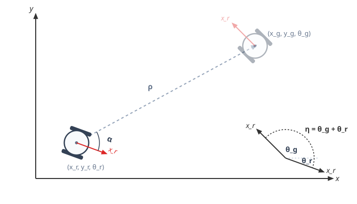
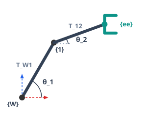
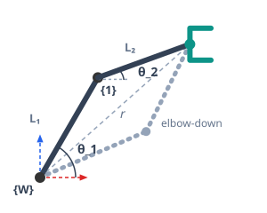
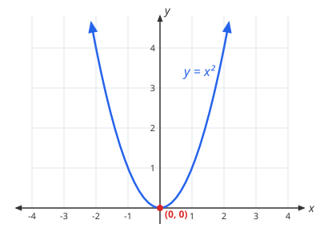
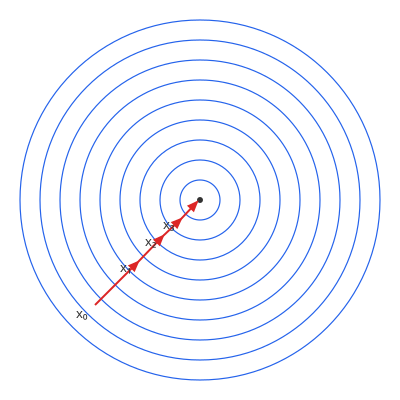
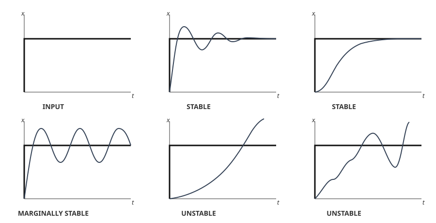
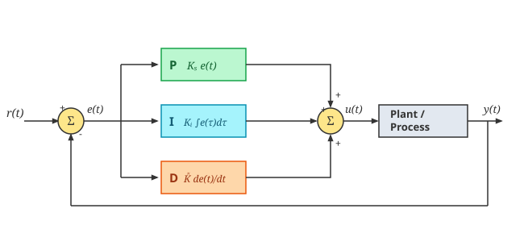

# Part III: Kinematics and Trajectory Control

Once we know where the robot is, we use control algorithms to move it to a goal. This is treated as an optimization problem: we want to minimize a error.


## Defining the Error

Before a robot can move toward a goal, it needs to know exactly how "wrong" its current pose is. The error between a robot's current pose $(x_r, y_r, \theta_r)$ and a goal pose $(x_g, y_g, \theta_g)$ is three-fold: a distance to cover, a direction to face to get there, and a final heading to end up at.

<p markdown="1" style="text-align:center;">

</p>

**Distance** ($\rho$) is just the straight-line distance to the goal:

$$
\rho = \sqrt{(x_g - x_r)^2 + (y_g - y_r)^2}
$$

**Direction** ($\alpha$) is the angle the robot needs to turn to face the goal, measured relative to its current heading:

$$
\alpha = \text{atan2}(y_g - y_r,\ x_g - x_r) - \theta_r
$$

**Heading error** ($\theta_e$) is simply how far off the robot's final orientation is from the goal's:

$$
\theta_e = \theta_g - \theta_r
$$

These three values — $\rho$, $\alpha$, $\theta_e$ — are exactly what gradient descent below tries to drive to zero.

## Forward Kinematics

Odometry, from the previous lecture, is a special case of **forward kinematics**: given a robot's actuator values, where does it end up?

A wheeled robot like the E-puck only has 2 of 6 possible degrees of freedom — translation along $X_R$ and rotation around $Z$:

<p markdown="1" style="text-align:center;">

</p>

$$
\Delta x = \frac{r\Delta\phi_l + r\Delta\phi_r}{2} \qquad \Delta\omega_z = \frac{r\Delta\phi_r - r\Delta\phi_l}{d}
$$

That's just the local step. Rotating it by the robot's current heading $\alpha$ and adding it to the previous pose gives its actual position in the world:

$$
x_w = x_w + \Delta x\cos\alpha \qquad y_w = y_w + \Delta x\sin\alpha \qquad \alpha = \alpha + \Delta\omega_z
$$

A robot arm's forward kinematics works the same way, just with a different actuator: each **joint angle** contributes a rotation followed by a fixed translation along the link to the next joint. Finding the end-effector's position is the same frame-chaining problem from spatial representation, applied once per joint:

<p markdown="1" style="text-align:center;">

</p>

$$
T^W_{ee} = T^W_1 \cdot T^1_2 \cdot T^2_3 \cdots T^{n-1}_{ee}
$$

Each $T^{i-1}_i$ has the same rotate-then-translate structure as the odometry matrix above — a rotation by the joint's own angle $\theta_i$, then a fixed translation of length $L_i$ (the link) along the rotated axis. For the 2-link arm:

$$
T^{i-1}_i = \begin{bmatrix} \cos\theta_i & -\sin\theta_i & L_i\cos\theta_i \\ \sin\theta_i & \cos\theta_i & L_i\sin\theta_i \\ 0 & 0 & 1 \end{bmatrix}
$$

Only $\theta_i$ changes as the joint rotates — $L_i$ is fixed by the arm's geometry. Multiplying the two matrices out:

$$
T^0_2 = T^0_1 \cdot T^1_2 = \begin{bmatrix} \cos(\theta_1+\theta_2) & -\sin(\theta_1+\theta_2) & L_1\cos\theta_1 + L_2\cos(\theta_1+\theta_2) \\ \sin(\theta_1+\theta_2) & \cos(\theta_1+\theta_2) & L_1\sin\theta_1 + L_2\sin(\theta_1+\theta_2) \\ 0 & 0 & 1 \end{bmatrix}
$$

The rotation part collapsed to $\theta_1+\theta_2$ because chaining two rotations just adds their angles. Reading the translation column straight off this matrix gives the end-effector's pose directly in the world frame:

$$
x_{ee} = L_1\cos\theta_1 + L_2\cos(\theta_1+\theta_2) \qquad y_{ee} = L_1\sin\theta_1 + L_2\sin(\theta_1+\theta_2)
$$

$$
\theta_{ee} = \theta_1 + \theta_2
$$

## Holonomic vs. Non-Holonomic Motion

The two forward kinematics above behave differently in an important way — whether a closed loop in joint space also closes the loop in the workspace:

- **Arm (holonomic):** the end-effector's pose depends only on the current joint angles $\theta_1, \theta_2$. Move the joints along any path and return them to their starting angles, and the end-effector is guaranteed to be back at its starting pose too.

- **Mobile robot (non-holonomic):** drive the wheels around and return them to their original rotation, and the robot won't generally be back at its starting position. The world pose depends on the path taken, not just the final wheel angles.

This difference makes us calculate the error differently. The arm can move freely in any direction, so the error vector can simply be:

$$
e = \begin{bmatrix} x_g \\ y_g \\ \theta_g \end{bmatrix} - \begin{bmatrix} x_r \\ y_r \\ \theta_r \end{bmatrix}
$$

The mobile robot can't move that freely, so its error has to be expressed in the $\rho$, $\alpha$, $\theta_e$ terms defined earlier instead:

$$
e = \begin{bmatrix} \rho \\ \alpha \\ \theta_e \end{bmatrix}
$$

## Inverse Kinematics

Forward kinematics answers "given these actuator values, where does the end-effector end up?" **Inverse kinematics** asks the opposite question: given a target pose, what actuator values get us there?

### For the Robot Arm

Because the arm is holonomic, its inverse kinematics has a direct, closed-form geometric solution. Given a target end-effector position $(x_{ee}, y_{ee})$, the base-to-target distance is:

$$
r = \sqrt{x_{ee}^2 + y_{ee}^2}
$$

$r$, $L_1$, and $L_2$ form a triangle, so the law of cosines gives the elbow angle directly:

$$
\theta_2 = \pm\cos^{-1}\left(\frac{r^2 - L_1^2 - L_2^2}{2L_1L_2}\right)
$$

<p markdown="1" style="text-align:center;">

</p>

The $\pm$ isn't a rounding artifact — it's two genuinely different, equally valid configurations reaching the same point: elbow up or elbow down. Once $\theta_2$ is picked, $\theta_1$ follows directly:

$$
\theta_1 = \text{atan2}(y_{ee}, x_{ee}) - \text{atan2}(L_2\sin\theta_2,\ L_1 + L_2\cos\theta_2)
$$

### For the Mobile Robot

The mobile robot doesn't get this luxury. Because it's non-holonomic, there's no closed-form mapping from a target pose straight to wheel angles — the path taken matters, not just the endpoint. That's exactly why the rest of this chapter builds the mobile robot's control at the velocity level instead of solving for a single actuator command: differential kinematics and gradient descent, continuously stepping the wheels toward the goal rather than computing it in one shot.

## Differential Kinematics

Forward kinematics relates actuator values to pose. **Differential kinematics** looks at the same relationship one derivative up: instead of position, we're relating *velocities*.

The derivative of distance is speed — $x$ is distance, $\dot x$ is speed. (You'll also see this written as $x'$; both mean the same thing.)

Applying this to the mobile robot: replace each incremental step ($\Delta x$, $\Delta\omega_z$, $\Delta\phi_l$, $\Delta\phi_r$) with its derivative, and the odometry formulas from earlier become a velocity relationship instead:

$$
\dot x = \frac{r\dot\phi_l + r\dot\phi_r}{2} \qquad \dot\omega_z = \frac{r\dot\phi_r - r\dot\phi_l}{d}
$$

Nothing about the geometry changed — $\dot\phi_l$ and $\dot\phi_r$ are just the wheels' angular velocities instead of a single timestep's rotation.

### Inverse Differential Kinematics

We can also go the other way: solve those same two equations for $\dot\phi_l$ and $\dot\phi_r$, to find the wheel velocities that produce a *desired* $\dot x$ and $\dot\omega_z$:

$$
\dot\phi_l = \frac{2\dot x - \dot\omega_z d}{2r} \qquad \dot\phi_r = \frac{2\dot x + \dot\omega_z d}{2r}
$$

## The Jacobian Matrix

In multi-degree-of-freedom systems, the simple 1D derivative is replaced by the **Jacobian Matrix** ($J$), which contains all the partial derivatives of the robot's kinematics. It relates a vector of actuator velocities $\dot q$ to the resulting task-space velocity $\nu$:

$$
\nu = \begin{bmatrix} \dot x \\ \dot y \\ \dot z \\ \omega_x \\ \omega_y \\ \omega_z \end{bmatrix} = \begin{bmatrix} \frac{\partial x}{\partial q_1} & \cdots & \frac{\partial x}{\partial q_n} \\ \frac{\partial y}{\partial q_1} & \cdots & \frac{\partial y}{\partial q_n} \\ \vdots & & \vdots \\ \frac{\partial \omega_z}{\partial q_1} & \cdots & \frac{\partial \omega_z}{\partial q_n} \end{bmatrix} \begin{bmatrix} \dot q_1 \\ \vdots \\ \dot q_n \end{bmatrix} = J(q)\cdot\dot q
$$

### For the Mobile Robot

The mobile robot's actuators are its two wheel velocities, $\dot q = [\dot\phi_l, \dot\phi_r]^T$. Writing out the partial derivatives gives:

$$
\begin{bmatrix} \dot x_R \\ \dot y_R \\ \dot\theta \end{bmatrix} = \begin{bmatrix} \frac{\partial x_R}{\partial \phi_l} & \frac{\partial x_R}{\partial \phi_r} \\ \frac{\partial y_R}{\partial \phi_l} & \frac{\partial y_R}{\partial \phi_r} \\ \frac{\partial \theta}{\partial \phi_l} & \frac{\partial \theta}{\partial \phi_r} \end{bmatrix} \begin{bmatrix} \dot\phi_l \\ \dot\phi_r \end{bmatrix} = \begin{bmatrix} \frac{r}{2} & \frac{r}{2} \\ 0 & 0 \\ -\frac{r}{d} & \frac{r}{d} \end{bmatrix} \begin{bmatrix} \dot\phi_l \\ \dot\phi_r \end{bmatrix}
$$

The middle row is zero — no combination of wheel velocities can move the robot along $y_R$ instantaneously. That's the differential-kinematics version of the non-holonomic constraint from earlier: dropping that always-zero row leaves exactly the $\dot x$, $\dot\omega_z$ relationship derived above.

### Inverting the Jacobian

To go the other way — from a desired task-space velocity to the actuator velocities that produce it — invert $J$. For a general $2\times2$ matrix:

$$
\begin{bmatrix} a & b \\ c & d \end{bmatrix}^{-1} = \frac{1}{ad-bc}\begin{bmatrix} d & -b \\ -c & a \end{bmatrix}
$$

Applying this to the mobile robot's Jacobian (dropping the always-zero $y_R$ row leaves a square, invertible $2\times2$ matrix):

$$
\begin{bmatrix} \dot\phi_l \\ \dot\phi_r \end{bmatrix} = \begin{bmatrix} \frac{r}{2} & \frac{r}{2} \\ -\frac{r}{d} & \frac{r}{d} \end{bmatrix}^{-1} \begin{bmatrix} \dot x_R \\ \dot\theta_R \end{bmatrix} = \frac{1}{r}\begin{bmatrix} 1 & -d/2 \\ 1 & d/2 \end{bmatrix} \begin{bmatrix} \dot x_R \\ \dot\theta_R \end{bmatrix}
$$

This is the same result as the Inverse Differential Kinematics above — just reached by inverting the matrix directly instead of solving the two equations by hand.

### Using the Jacobian for Gradient Descent

The general control law for reducing an error $e$ with the Jacobian is:

$$
\Delta q = -J^+e
$$

For the mobile robot, that error is exactly $\rho$ and $\alpha$ from earlier. Plugging them into the inverse Jacobian above gives the wheel velocities directly, with no need to go through $\dot x_R$ and $\dot\theta_R$ at all:

$$
\begin{bmatrix} \dot\phi_l \\ \dot\phi_r \end{bmatrix} = \frac{1}{r}\begin{bmatrix} 1 & -d/2 \\ 1 & d/2 \end{bmatrix} \begin{bmatrix} \rho \\ \alpha \end{bmatrix}
$$

Absorbing $r$ and $d$ into a pair of tunable gains $p_1$, $p_2$, this is exactly the same P-controller derived below in Gradient Descent — just arrived at directly from the Jacobian instead of taking partial derivatives of the error function:

```
leftwheel  = -p1 * alpha + p2 * rho
rightwheel =  p1 * alpha + p2 * rho
```

## Minimizing Error

At the beginning of this lecture, we defined a robot's error as the difference between its current pose and the goal pose it needs to reach. Driving the robot to its goal is really just minimizing this error function, and the technique we'll use to do it is **gradient descent**.

Take the simplest possible error function, $y = x^2$: its minimum sits at $x=0$, and its derivative at any point tells us which way is downhill.

<p markdown="1" style="text-align:center;">

</p>

Stepping opposite that derivative, a little at a time, always walks you toward the minimum — no matter which side you started on. With more variables, this becomes stepping opposite the full gradient, sliding down toward the center of the error function's contours:

<p markdown="1" style="text-align:center;">

</p>

This is the exact technique we'll use to build the robot's controller below: measure the error, step opposite its gradient, and repeat until it reaches zero.

### Gradient Descent

In discrete time, this stepping process becomes an update rule: at each timestep $k$, nudge $x$ opposite the derivative, scaled by a gain $L$ that controls how big each step is:

$$
x_{k+1} = x_k - L\,f'(x_k)
$$

### Typical Controller Behavior

That gain $L$ is what determines whether the controller actually converges. Given a step input to track, the response can look very different depending on how it's tuned:

<p markdown="1" style="text-align:center;">

</p>

- **Stable** — the error settles at zero, either smoothly or with some decaying oscillation on the way there.
- **Marginally stable** — the error keeps oscillating around zero forever, never quite settling.
- **Unstable** — the error grows without bound, either steadily or through ever-larger oscillations. A gain that's too large is a common cause of this.

### For the Mobile Robot

Let's apply this directly to the mobile robot. Its control inputs are $\dot x$ and $\dot\theta_r$, and its error components $\rho$, $\alpha$ from earlier are already given in polar coordinates. A convenient error function to minimize is the sum of their squares:

$$
e = \rho^2 + \alpha^2
$$

Following the gradient descent rule, each control input steps opposite the error's partial derivative with respect to its matching term:

$$
\dot x = -p_2\frac{\partial e}{\partial \rho} \qquad \dot\theta_r = -p_1\frac{\partial e}{\partial \alpha}
$$

Solving for the wheel speeds with the inverse differential kinematics from earlier:

$$
\dot\phi_l = \frac{2p_2\rho - p_1\alpha d}{2r} \qquad \dot\phi_r = \frac{2p_2\rho + p_1\alpha d}{2r}
$$

Compare this with the intuitive result: drive faster the farther the goal is, and turn faster the more misaligned the heading is. Absorbing the constants into $p_1$ and $p_2$, this collapses into the simple P-controller used in the code below:

```
leftwheel  = -p1 * alpha + p2 * rho
rightwheel =  p1 * alpha + p2 * rho
```

## PID Control

The controller derived above is a pure **Proportional (P)** controller — the control signal is proportional only to the current error. In general, a control signal can be made up of three terms:

- **P** — proportional to the current error.
- **I** — proportional to the integral of past errors.
- **D** — proportional to the derivative of the error.

<p markdown="1" style="text-align:center;">

</p>

$$
u(t) = K_p\,e(t) + K_i\int_0^t e(\tau)\,d\tau + K_d\,\frac{de(t)}{dt}
$$

In practice, the integral term is computed by summing up just the last $N$ error terms rather than the entire history, to prevent **wind-up** — a large accumulated error continuing to push the controller long after it's no longer relevant. The derivative term reacts to how fast the error is changing, which increases the speed of convergence.

## Examples in Practice

### Mobile Robot

Pulling every step above together for the mobile robot:

<p markdown="1" style="text-align:center;">

</p>

1. **Error** — from the current and goal poses, compute $\rho$ (distance) and $\alpha$ (heading-to-goal).
2. **Gradient descent** — minimizing $e = \rho^2 + \alpha^2$ gives $\dot x = p_2\rho$ and $\dot\theta_r = -p_1\alpha$.
3. **Inverse kinematics** — the inverse Jacobian converts that desired velocity into wheel speeds:

$$
\text{leftwheel} = -p_1\alpha + p_2\rho \qquad \text{rightwheel} = p_1\alpha + p_2\rho
$$

Code:

```python
rho = np.sqrt((xw - target_x)**2 + (yw - target_y)**2)
alpha = np.arctan2(target_y - yw, target_x - xw) - theta

leftwheel = -p1 * alpha + p2 * rho
rightwheel = p1 * alpha + p2 * rho

motor_left.setVelocity(leftwheel)
motor_right.setVelocity(rightwheel)
```

Every control loop iteration just repeats these three steps: measure the error, step opposite its gradient, convert to wheel speeds, and move.

### Robot Arm

The exact same logic applies to the 2-link arm — just with its own error and its own Jacobian.

**Error** is the difference between the goal pose and the end-effector's current pose:

$$
e = \begin{bmatrix} x_g \\ y_g \\ \theta_g \end{bmatrix} - \begin{bmatrix} x_{ee} \\ y_{ee} \\ \theta_{ee} \end{bmatrix}
$$

<p markdown="1" style="text-align:center;">

</p>

**Gradient descent** uses the arm's own Jacobian derived earlier:

$$
J = \begin{bmatrix} -L_1\sin\theta_1 - L_2\sin(\theta_1+\theta_2) & -L_2\sin(\theta_1+\theta_2) \\ L_1\cos\theta_1 + L_2\cos(\theta_1+\theta_2) & L_2\cos(\theta_1+\theta_2) \\ 1 & 1 \end{bmatrix}
$$

and the same control law:

$$
\Delta q = -J^+e
$$

$J$ isn't square here — 3 task-space dimensions but only 2 joints — so $J^+$ is the Moore-Penrose pseudo-inverse rather than a plain matrix inverse. It plays exactly the same role as the mobile robot's inverse Jacobian above, just computed numerically instead of by hand.

**Final output** — just like the mobile robot's pose update, each joint angle simply gets nudged by its share of $\Delta q$ every iteration:

$$
\theta_1 = \theta_1 + \Delta\theta_1 \qquad \theta_2 = \theta_2 + \Delta\theta_2
$$

Code:

```python
e = np.array([xg - xee, yg - yee, thetag - thetaee])

J = np.array([[-L1*np.sin(theta1) - L2*np.sin(theta1+theta2), -L2*np.sin(theta1+theta2)],
              [ L1*np.cos(theta1) + L2*np.cos(theta1+theta2),  L2*np.cos(theta1+theta2)],
              [1, 1]])

deltaQ = -np.linalg.pinv(J) @ e

theta1 = theta1 + deltaQ[0]
theta2 = theta2 + deltaQ[1]
```