# Part IV: Mapping and Navigation

## Why Navigation?

So far, every controller we've built assumes a clear, straight-line path to the goal: sense the error, and drive it to zero. But what happens when there's an obstacle sitting directly between the robot and its goal?

<p markdown="1" style="text-align:center;">
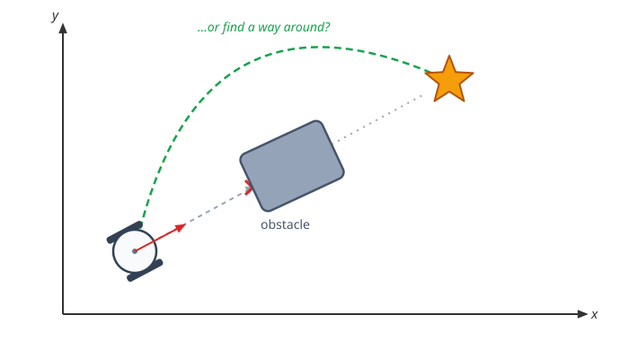
</p>

A controller alone can't solve this — it only knows how to reduce distance and heading error, not what's in the way. To get around the obstacle, the robot first needs a **map** of its environment, and then a **path** through that map for the controller to follow. This chapter covers both.

## Configuration Space and Waypoints

The way to actually build that path is to first inflate the obstacle by the robot's own size, until the robot can be treated as a single point. Any point outside this inflated boundary is guaranteed collision-free, no matter which way the robot is facing.

A path planner searches this free space for a sequence of **waypoints** — intermediate goal poses that string together into a full path around the obstacle. The controller from Chapter 3 doesn't change at all: it just drives to each waypoint in turn, one at a time, until it reaches the final goal.

<p markdown="1" style="text-align:center;">
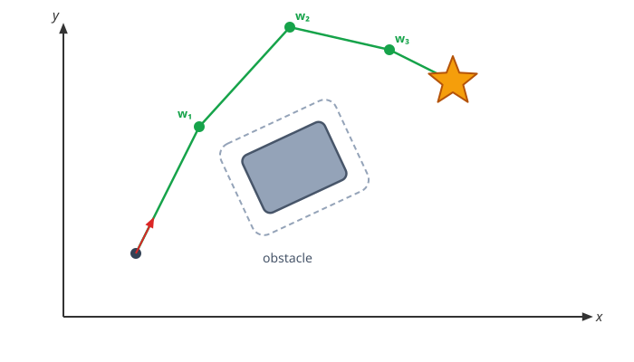
</p>

This growing trick works because we're treating the robot as a circle: since it looks the same from every angle, inflating the obstacle by its radius gives a single 2D map that's valid no matter the robot's heading.

<div markdown="1" style="display:flex; justify-content:center; align-items:flex-start; flex-wrap:wrap; gap:24px;">

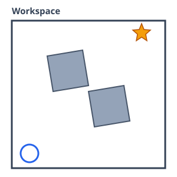

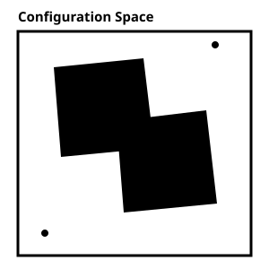

</div>

A non-circular mobile robot wouldn't get away with just one 2D map like this — it would need a different one for every possible heading.

<div markdown="1" style="display:flex; justify-content:center; align-items:flex-start; flex-wrap:wrap; gap:24px;">

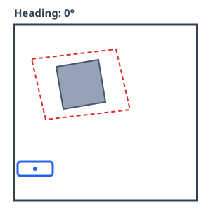

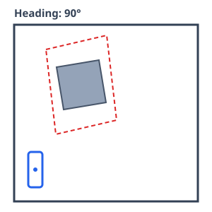

</div>

A robot's **configuration space** (or **C-space**) is the minimal set of numbers that fully describes its pose — for a mobile robot, that's its position and heading $(x, y, \theta)$; for an arm, it's the joint angles $(q_1, \dots, q_n)$. 


<div markdown="1" style="display:flex; justify-content:center; align-items:flex-start; flex-wrap:wrap; gap:24px;">

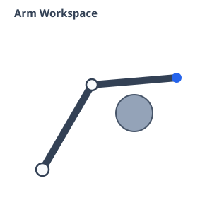

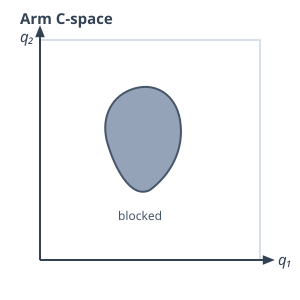

</div>

## Mapping

In order to build the waypoints, we first need a map of the environment. This map can be acquired **offline** — built ahead of time, before the robot ever moves — or **online**, with the robot exploring on its own and building the map as it goes, until it has learned enough of the room to plan a path.

One common way to build a map online is to scan the environment with a lidar sensor that measures distance to nearby surfaces, marking a point everywhere a beam hits something solid and building up a **point cloud** of the space around it.

<div markdown="1" style="display:flex; justify-content:center; align-items:flex-start; flex-wrap:wrap; gap:24px;">

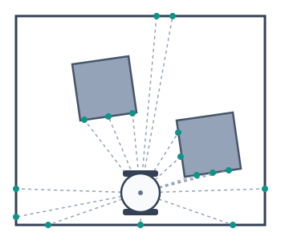

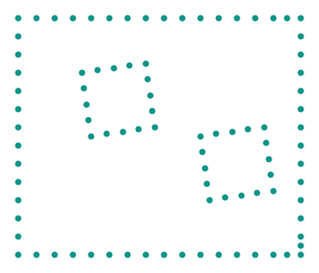

</div>

That point cloud can then be turned into an **occupancy grid**: divide the room into a grid of cells, and mark each one `1` if any point fell inside it, or `0` if it's still empty. The path planner can search directly over this grid instead of the raw points.

<p markdown="1" style="text-align:center;">
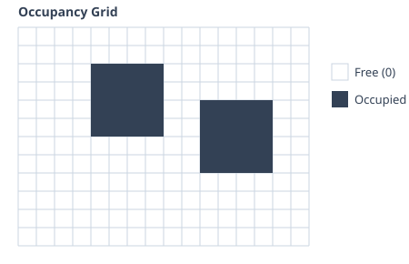
</p>

We can inflate the obstacle in the grid to account for the robot's own size using a simple image-processing technique called **convolution**: slide a small window — a **kernel**, sized to the robot's footprint — across the grid, and mark a cell occupied if any occupied cell falls inside the kernel centered on it. The obstacle grows by exactly the kernel's size.

<div markdown="1" style="display:flex; justify-content:center; align-items:flex-start; flex-wrap:wrap; gap:24px;">

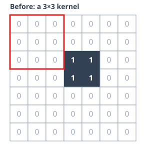


</div>

## Navigation

Once we have the map, how do we get the waypoints? We can treat the grid as a graph problem: treat every free cell as a node, connect it to its free neighbors, and search that graph for the shortest path from the robot's cell to the goal's cell — with algorithms like **Dijkstra** or **A\***.

<div markdown="1" style="display:flex; justify-content:center; align-items:flex-start; flex-wrap:wrap; gap:24px;">

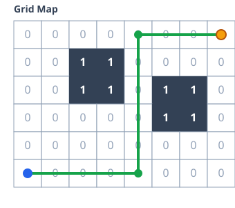

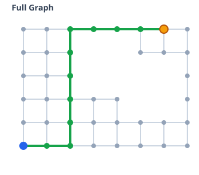

</div>

This conversion only goes one way — a grid always maps cleanly to a graph, but not every graph corresponds to a grid.

### Graphs

A graph is simply **nodes** connected by **edges**. If the edges have direction, it's a **directed graph**.

<p markdown="1" style="text-align:center;">
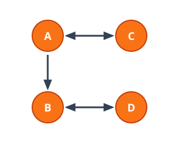
</p>

```python
graph = {'A': ['B', 'C'],
         'B': ['D'],
         'C': ['A'],
         'D': ['B']}

path = ['A', 'B', 'D']  # sample
```

Edges can also carry a **weight** — a cost like distance, time, energy, or number of turns. Finding the path that minimizes total cost is the **shortest path problem**, exactly what Dijkstra and A\* solve.

<p markdown="1" style="text-align:center;">
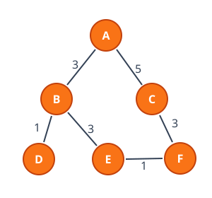
</p>

```python
graph = {'A': {'B': 3, 'C': 5},
         'B': {'A': 3, 'D': 1, 'E': 3},
         'C': {'A': 5, 'F': 3},
         'D': {'B': 1},
         'E': {'B': 3, 'F': 1},
         'F': {'C': 3, 'E': 1}}
```

### Exploring the Graph

Having a graph isn't enough — we still have to **explore** it to find a path. **Breadth-first search (BFS)** visits every neighbor before going deeper, using a FIFO queue; **depth-first search (DFS)** commits to one path as deep as it can go, using a LIFO stack.

<div markdown="1" style="display:flex; justify-content:center; align-items:flex-start; flex-wrap:wrap; gap:24px;">

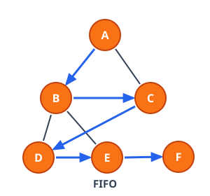

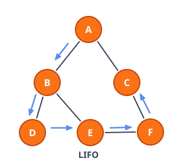

</div>

### Dijkstra's Algorithm

Dijkstra's algorithm is designed to find the shortest path in a weighted graph. It is essentially a weighted version of Breadth-First Search (BFS): it always expands the node with the lowest cost-so-far, $g$. If $u$ is the node being expanded, $v$ one of its neighbors, and $w(u, v)$ the weight of the edge between them, then $v$'s cost is updated by **relaxation**:

$$
g(v) = \min\Big(g(v),\ g(u) + w(u, v)\Big)
$$

<p markdown="1" style="text-align:center;">
</p>

### A* Search

A\* is simply an extension of Dijkstra's algorithm. The critical difference is that A\* is informed, whereas Dijkstra's is blind — it ranks nodes by $f = g + h$, where $g$ is the cost so far and $h$ is a heuristic estimate of the remaining distance to the goal.

Manhattan distance and Euclidean distance are both common, good heuristics.

$$
h_{\text{Manhattan}} = |x - x_{\text{goal}}| + |y - y_{\text{goal}}| \qquad h_{\text{Euclidean}} = \sqrt{(x - x_{\text{goal}})^2 + (y - y_{\text{goal}})^2}
$$

<p markdown="1" style="text-align:center;">

</p>

## Examples in Practice


### Grids to Graphs

In order to go from a grid to a graph, every free cell becomes a node, connected to whichever of its neighbors are also free. Instead of labeling nodes `'A'`, `'B'`, `'C'`, ..., a grid's nodes can just be their `(row, col)` tuples, and rather than typing the graph out by hand like the small examples earlier, it can be generated directly from the grid itself:

<div markdown="1" style="display:flex; justify-content:center; align-items:flex-start; flex-wrap:wrap; gap:24px;">

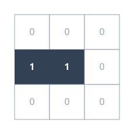


</div>

```python
grid = [[0, 0, 0],
        [1, 1, 0],
        [0, 0, 0]]

def get_neighbors(u: tuple, grid: list):
    neighbors = []
    for delta in ((0, 1), (0, -1), (1, 0), (-1, 0)):
        cand = (u[0] + delta[0], u[1] + delta[1])
        
        if cand[0] < 0 or cand[1] < 0:
            continue
        if cand[0] >= len(grid) or cand[1] >= len(grid[0]):
            continue
            
        if grid[cand[0]][cand[1]] == 0:
            neighbors.append(cand)
            
    return neighbors

def build_graph(grid: list):
    graph = {}
    
    for row in range(len(grid)):
        for col in range(len(grid[0])):
            if grid[row][col] == 0:
                current_node = (row, col)
                graph[current_node] = get_neighbors(current_node, grid)
                
    return graph
```

### Finding the Shortest Path

The graph below can be handed to any of the four search algorithms in this chapter to find the shortest path from start to goal.

<p markdown="1" style="text-align:center;">

</p>

BFS pulls from a FIFO queue: `queue.pop(0)` always removes the oldest entry from the front, so every neighbor gets visited before the search goes deeper:

```python
graph = {'A' : ['B', 'C'],
         'B' : ['A', 'D', 'E'],
         'C' : ['A', 'F'],
         'D' : ['B'],
         'E' : ['B', 'F'],
         'F' : ['C', 'E']
}

start = 'A'
goal = 'F'

# EXPLORE 
queue = [start]
visited = set(start)
parent = {}
while queue:
    v = queue.pop(0)    # FIFO: remove from the front
    for u in graph[v]:
        if u not in visited:
            queue.append(u)
            visited.add(u)
            parent[u] = v

# SHORTEST PATH           
key = goal
path = []
while key in parent.keys():
    key = parent[key]
    path.insert(0, key) # Add to the front of the list
    
path.append(goal)
```

DFS is nearly identical — swap the queue for a LIFO stack: `stack.pop()` removes the most recent entry from the back, letting the search commit to one path as deep as it can go before backtracking.

Dijkstra's swaps the stack for a priority queue ordered by cost, so it always expands the cheapest node next instead of the most recently discovered one.

<p markdown="1" style="text-align:center;">
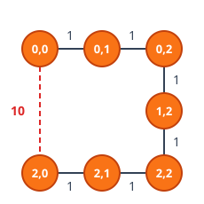
</p>

```python
import heapq

def dijkstra(graph, start, goal):
    g = {start: 0}
    queue = [(0, start)]
    previous = {}

    while queue:
        cost, node = heapq.heappop(queue)
        if node == goal:
            return previous
        for neighbor, weight in graph[node].items():
            new_cost = cost + weight
            if new_cost < g.get(neighbor, float('inf')):
                g[neighbor] = new_cost
                previous[neighbor] = node
                heapq.heappush(queue, (new_cost, neighbor))
```

Run on `weighted_graph`, Dijkstra ignores the tempting shortcut and returns the cheap six-step route instead, exactly as the diagram above shows.

A\* reuses Dijkstra almost exactly — the only change is adding the Manhattan-distance heuristic to what gets pushed onto the heap:

```python
def manhattan(a, b):
    return abs(a[0] - b[0]) + abs(a[1] - b[1])

def astar(graph, start, goal):
    g = {start: 0}
    queue = [(manhattan(start, goal), start)]
    previous = {}

    while queue:
        _, node = heapq.heappop(queue)
        if node == goal:
            return previous
        for neighbor in graph[node]:
            new_cost = g[node] + 1
            if new_cost < g.get(neighbor, float('inf')):
                g[neighbor] = new_cost
                previous[neighbor] = node
                heapq.heappush(queue, (new_cost + manhattan(neighbor, goal), neighbor))
```

All four end up walking the exact same graph — the only thing that changes between them is which node gets popped next, and that one choice is the whole difference between blindly flooding outward and searching with a sense of direction.
