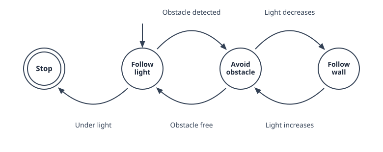
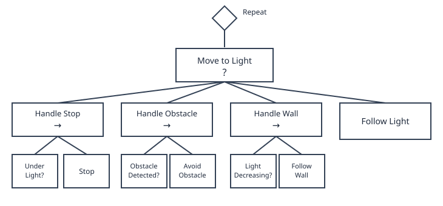

# Part V: Task Planning and Execution

## Why Task Planning?

Every tool built so far solves one problem at a time: a controller drives to a single goal, a planner finds one path around one set of obstacles. But a real task is rarely just one of those in isolation — it's a sequence of different behaviors, each active only under the right conditions. A robot might need to follow a light source, until an obstacle gets in the way, at which point it should switch to avoiding it, then go back to following the light once the obstacle is cleared.

None of the controllers or planners from earlier chapters know how to make that switch on their own — they just do the one thing they were built for. What's missing is a layer above them that decides *which* behavior should be running right now, and *when* to switch to another one. That's what this chapter covers, starting with the simplest tool for the job: the **state machine**.

## State Machines

A state machine describes a system as a finite set of **states**, together with the rules for moving between them. Formally, it's the tuple $(S, \Sigma, \delta, s_0, F)$:

- $S$: a finite set of **states** — the distinct behaviors or modes the robot can be in
- $s_0$: the **initial state**, the one the robot starts in
- $\Sigma$: the **input alphabet** — the set of conditions or events the robot can react to
- $\delta$: the **transition function**, $\delta: S \times \Sigma \rightarrow S$, mapping a state and an input to the next state
- $F$: the set of **final states**, where the machine stops

As the robot's environment gets more dynamic, more transitions are needed to react to it, and the diagram above quickly turns into a tangle of crossing arrows. Adding a single new state makes this worse: every state needs its own outbound transition for every condition it might face, so the number of transitions grows combinatorially with the number of states.

## Behavior Trees

State machines get even harder to manage once failure handling is added — every step also needs a way to retry or recover when it doesn't succeed, which means wiring up still more transitions by hand. **Behavior trees** sidestep this by organizing behavior as a tree of composable nodes instead of a flat set of states and transitions.

The actual implementation lives in the **leaves** — the individual actions the robot performs, each of which either **succeeds** or **fails**.

A **sequence** node (`→`) groups leaves together and runs them in order, advancing only as long as each one succeeds; if any leaf fails, the whole sequence fails, and it only succeeds once every leaf has.

A **selector** node (`?`) instead tries its children left to right and stops at the first one that succeeds, only failing if all of them do — a natural way to express a fallback, like trying to avoid an obstacle before falling back to just following the light.

Naively, each leaf would run to completion before the tree moves on, so a slow leaf could block everything else for seconds at a time. Real implementations avoid this with a third leaf status, `RUNNING`, and re-evaluate the whole tree on a fixed interval called a **tick** (e.g. every 32 ms), picking back up from whatever was last `RUNNING` — which is what makes behavior trees reactive in real time and lets multiple branches run in parallel.

