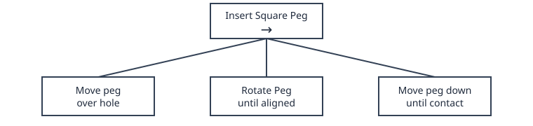
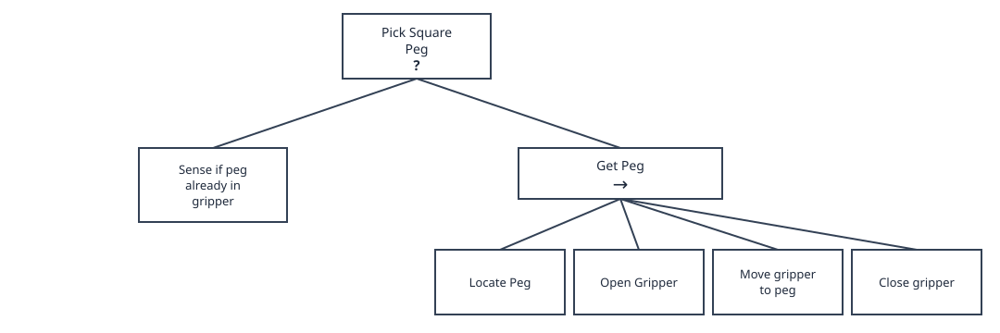

# Part V: Task Planning and Execution

## Why Task Planning?

Every tool built so far solves one problem at a time: a controller drives to a single goal, a planner finds one path around one set of obstacles. But a real task is rarely just one of those in isolation — it's a sequence of different behaviors, each active only under the right conditions. A robot might need to follow a light source, until an obstacle gets in the way, at which point it should switch to avoiding it, then go back to following the light once the obstacle is cleared.

None of the controllers or planners from earlier chapters know how to make that switch on their own — they just do the one thing they were built for. What's missing is a layer above them that decides *which* behavior should be running right now, and *when* to switch to another one. That's what this chapter covers, starting with the simplest tool for the job: the **state machine**.

## State Machines

A state machine describes a system as a finite set of **states**, together with the rules for moving between them. Formally, it's the tuple $(S, \Sigma, \delta, s_0, F)$:

- $S$: a finite set of **states** — the distinct behaviors or modes the robot can be in
- $s_0$: the **initial state**, the one the robot starts in
- $\Sigma$: the **input alphabet** — the set of conditions or events the robot can react to
- $\delta$: the **transition function**, $\delta: S \times \Sigma \rightarrow S$, mapping a state and an input to the next state
- $F$: the set of **final states**, where the machine stops

As the robot's environment gets more dynamic, more transitions are needed to react to it, and the diagram above quickly turns into a tangle of crossing arrows. Adding a single new state makes this worse: every state needs its own outbound transition for every condition it might face, so the number of transitions grows combinatorially with the number of states.

## Behavior Trees

State machines get even harder to manage once failure handling is added — every step also needs a way to retry or recover when it doesn't succeed, which means wiring up still more transitions by hand. **Behavior trees** sidestep this by organizing behavior as a tree of composable nodes instead of a flat set of states and transitions.

### Leaf Nodes and Sequence Nodes

The actual implementation lives in the **leaves** — the individual actions the robot performs. **Sequence** nodes group leaves together and run them in order. Every leaf either **succeeds** or **fails**: a sequence keeps advancing through its children as long as they succeed, but fails immediately if any of them does. Only if every leaf succeeds does the sequence succeed too.

### Selector Nodes

**Selector** nodes try their children left to right and stop at the first one that succeeds; if every child fails, the selector fails too. This is a natural way to express a fallback: try the cheap check first, and only fall back to the full action if it doesn't succeed.

Reproducing this same fallback-and-retry logic in a plain state machine would mean adding an explicit failure transition out of every single leaf-turned-state, back to whichever state should handle the retry — reintroducing exactly the transition explosion from before. A behavior tree gets that retry logic for free, just from the type of node used to group its children.

