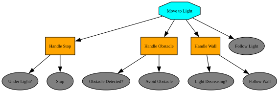

# Part V: Task Planning and Execution

## Why Task Planning?

Every tool built so far solves one problem at a time: a controller drives to a single goal, a planner finds one path around one set of obstacles. But a real task is rarely just one of those in isolation — it's a sequence of different behaviors, each active only under the right conditions. A robot might need to follow a light source, until an obstacle gets in the way, at which point it should switch to avoiding it, then go back to following the light once the obstacle is cleared.

None of the controllers or planners from earlier chapters know how to make that switch on their own — they just do the one thing they were built for. What's missing is a layer above them that decides *which* behavior should be running right now, and *when* to switch to another one. That's what this chapter covers, starting with the simplest tool for the job: the **state machine**.

## State Machines

A state machine describes a system as a finite set of **states**, together with the rules for moving between them. Formally, it's the tuple $(S, \Sigma, \delta, s_0, F)$:

- $S$: a finite set of **states** — the distinct behaviors or modes the robot can be in
- $s_0$: the **initial state**, the one the robot starts in
- $\Sigma$: the **input alphabet** — the set of conditions or events the robot can react to
- $\delta$: the **transition function**, $\delta: S \times \Sigma \rightarrow S$, mapping a state and an input to the next state
- $F$: the set of **final states**, where the machine stops

<p markdown="1" style="text-align:center;">

</p>

As the robot's environment gets more dynamic, more transitions are needed to react to it, and the diagram above quickly turns into a tangle of crossing arrows. Adding a single new state makes this worse: every state needs its own outbound transition for every condition it might face, so the number of transitions grows combinatorially with the number of states.

## Behavior Trees

State machines get even harder to manage once failure handling is added — every step also needs a way to retry or recover when it doesn't succeed, which means wiring up still more transitions by hand. **Behavior trees** sidestep this by organizing behavior as a tree of composable nodes instead of a flat set of states and transitions.

The actual implementation lives in the **leaves** — the individual actions the robot performs, each of which either **succeeds** or **fails**.

A **sequence** node (`→`) groups leaves together and runs them in order, advancing only as long as each one succeeds; if any leaf fails, the whole sequence fails, and it only succeeds once every leaf has.

A **selector** node (`?`) instead tries its children left to right and stops at the first one that succeeds, only failing if all of them do — a natural way to express a fallback, like trying to avoid an obstacle before falling back to just following the light.

<p markdown="1" style="text-align:center;">

</p>

Each leaf actually returns one of three results: success, failure, or **running**, if it isn't done yet. Instead of letting a slow leaf block everything else, the whole tree gets re-checked on a fixed interval called a **tick** — say, every 32 ms — picking back up from whichever leaf was still running last time. This is what makes behavior trees reactive in real time, and it's also what makes it possible to run several branches at once.

A **parallel** node (`⇉`) does exactly that: instead of trying its children one at a time like a sequence or selector, it runs all of them at the same time, succeeding based on a policy set on the node — every child must succeed, only one has to, or at least $n$ of them do. In our light-following robot, one branch can keep sensing the environment while another branch, the `Move to Light` tree from before, decides what to do with it.

<p markdown="1" style="text-align:center;">

</p>

Running side by side only works if the two branches can share what they find, so parallel nodes are usually paired with a **blackboard** — memory any branch can read or write. Here, `Sense Environment` writes the light level and obstacle distance it measures, and `Move to Light` reads them back on its next tick.

## Examples in Practice

### Finite State Machines

Translating the light-following state machine into code is mostly a matter of naming its pieces: $S$, $\Sigma$, and $F$ become plain Python sets, while $\delta$ becomes a dictionary keyed by `(state, event)` pairs:

```python
S = {'Stop', 'Follow light', 'Avoid obstacle', 'Follow wall'}
Sigma = {'Obstacle detected', 'Obstacle free', 'Light decreases', 'Light increases', 'Under light'}
F = {'Stop'}

delta = {
    ('Follow light', 'Obstacle detected'): 'Avoid obstacle',
    ('Avoid obstacle', 'Obstacle free'):   'Follow light',
    ('Avoid obstacle', 'Light decreases'): 'Follow wall',
    ('Follow wall', 'Light increases'):    'Avoid obstacle',
    ('Follow light', 'Under light'):       'Stop',
}

def step(state, event):
    key = (state, event)
    if key in delta:
        return delta[key]
    return state  # no transition defined, stay in the same state

state = 'Follow light'  # s0
events = ['Obstacle detected', 'Obstacle free', 'Under light']

for event in events:
    state = step(state, event)
    print(state)
    if state in F:
        break

# Avoid obstacle
# Follow light
# Stop
```

### Behavior Trees

The `Move to Light` tree translates into code with the help of [py_trees](https://py-trees.readthedocs.io/), a Python behavior tree library, which can also render the diagram below straight from the code via [Graphviz](https://graphviz.org/download/):

<p markdown="1" style="text-align:center;">

</p>

```python
import time

import py_trees
from py_trees.common import Status

world = {
    "under_light": False,
    "obstacle": False,
    "light_decreasing": False,
}

class Leaf(py_trees.behaviour.Behaviour):
    """Wraps one plain function as a leaf; fails only if it returns False."""
    def __init__(self, name, func):
        super().__init__(name)
        self.func = func

    def update(self):
        if self.func() is False:
            return Status.FAILURE
        return Status.SUCCESS

handle_stop = py_trees.composites.Sequence(name="Handle Stop", memory=False, children=[
    Leaf("Under Light?", lambda: world["under_light"]),
    Leaf("Stop", lambda: print("Stop")),
])

handle_obstacle = py_trees.composites.Sequence(name="Handle Obstacle", memory=False, children=[
    Leaf("Obstacle Detected?", lambda: world["obstacle"]),
    Leaf("Avoid Obstacle", lambda: print("Avoid Obstacle")),
])

handle_wall = py_trees.composites.Sequence(name="Handle Wall", memory=False, children=[
    Leaf("Light Decreasing?", lambda: world["light_decreasing"]),
    Leaf("Follow Wall", lambda: print("Follow Wall")),
])

move_to_light = py_trees.composites.Selector(name="Move to Light", memory=False, children=[
    handle_stop,
    handle_obstacle,
    handle_wall,
    Leaf("Follow Light", lambda: print("Follow Light")),
])

tree = py_trees.trees.BehaviourTree(move_to_light)
py_trees.display.render_dot_tree(move_to_light)  # writes move_to_light.png/.svg/.dot next to this script

# One world change per tick, like the finite state machine's list of events.
events = [
    {},
    {"obstacle": True},
    {"obstacle": False, "light_decreasing": True},
    {"light_decreasing": False},
    {"under_light": True},
]

for event in events:
    world.update(event)
    tree.tick()
    time.sleep(0.5)  # wait half a second before the next tick

# Follow Light
# Avoid Obstacle
# Follow Wall
# Follow Light
# Stop
```


